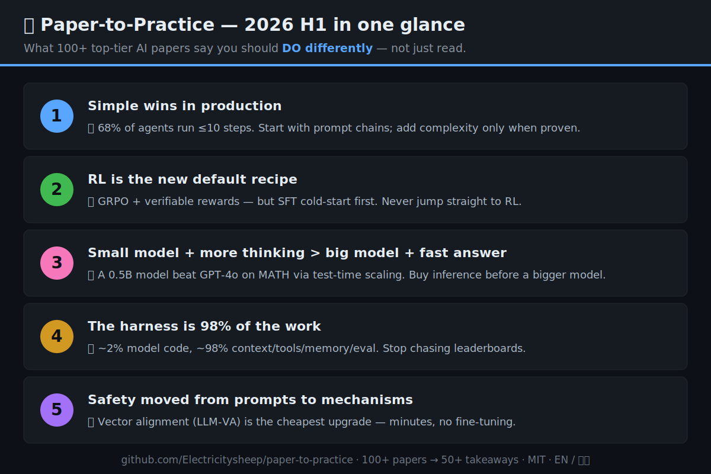
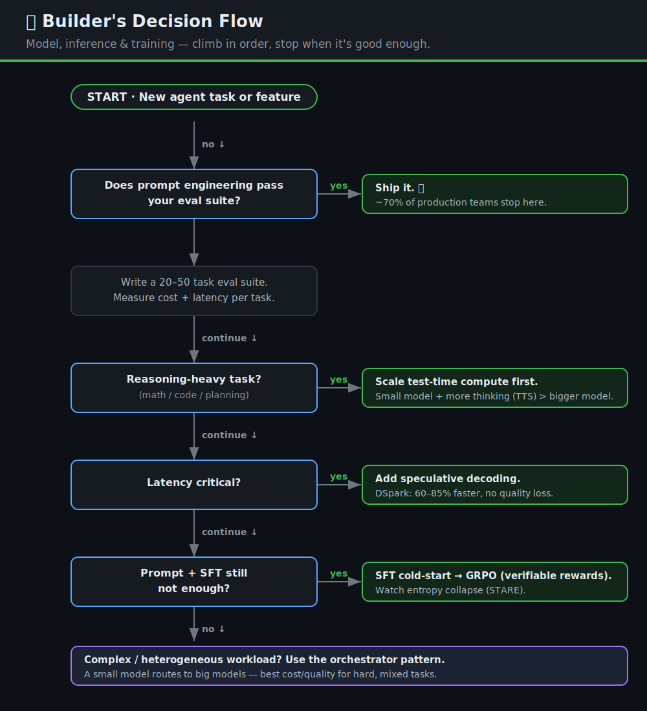

# 🤖 Paper-to-Practice：从学术论文到AI Agent实战

  <b>唯一一个告诉你"该怎么改",而不只是"读什么"的 AI 研究清单。</b> 
  📄 100+ 篇顶会论文 → 💡 50+ 条生产实践建议(面向 AI Agent 开发者) 
  ICLR · ICML · ACL · CVPR · Nature MI — 2026 上半年 + 每月持续更新

  
  
  
  
  

  📅 最新月报：<a href="papers/2026-07-spotlight.md">2026 年 7 月速览</a> · <a href="papers/2026-h1-review.md">主索引(100+ 论文)</a>

---

## ⚡ 为什么需要这个仓库

2026年，**AI Agent从实验室走向了生产线**。但学术研究与工程实践之间仍存在巨大的鸿沟：

| 学术界产出的是... | 从业者需要的是... |
|---|---|
| 每月数千篇arXiv论文（仅cs.AI） | "我到底该怎么做？" |
| 数学证明和消融实验 | 架构决策和部署清单 |
| 精选数据集上的基准分数 | 真实生产环境中的可靠性 |

**这个仓库填补了这道鸿沟。** 每篇论文都有 **💡 对从业者的意义** 板块——具体、可操作的行动建议。

### 🆚 和其他 awesome 列表有什么不同

| 常见 awesome 列表 | Paper-to-Practice |
|---|---|
| 论文标题 + 一句话摘要 | 论文卡片 **+ 一条"该怎么改"的行动建议** |
| 一份收藏夹清单 | 5 篇**实战指南**,把洞见变成清单 |
| "该读什么" | "你的系统该改什么" |

> 👉 **新来的?先看 [📇 主索引](papers/2026-h1-review.md)** —— 每篇论文,一行,一条建议。
>
> 📖 [English Version →](README.md)

---

## 📸 上半年一图速览

  

☝️ 收藏、转发。100+ 篇论文沉淀出的 5 条教训。

---

## 📊 数据看板

| 指标 | 数值 |
|---|---|
| 📄 覆盖论文 | **100+**（[完整索引](papers/2026-h1-review.md)） |
| 🔬 深度解读卡片 | **68** 篇（含完整分析 + 建议） |
| 🏫 覆盖机构 | **30+**（清华、北大、Stanford、MIT、Berkeley、CMU、Oxford、DeepMind、Meta、Google、DeepSeek...） |
| 📅 时间跨度 | **2026年1月–6月** |
| 🎯 研究主题 | **10** 大方向 |
| 💡 实用建议 | **50+** 条 |
| 🌐 语言 | **English + 中文**（完全双语） |

---

## ⚡ 5分钟速览：2026上半年教会我们什么

### 1. Agent系统已进入生产环境（但简单才是王道）
> MAP研究（ICML 2026 Oral）调研了86位从业者（另有20个深度访谈），覆盖26个领域：**68%的生产Agent执行不超过10步**就需要人工介入。**70%使用提示工程而非微调。** 最大挑战是**可靠性而非能力**。

**💡**：别过度设计。从简单的提示链开始，只在必要时加RL。([深入阅读 →](topics/agent-systems.md))

### 2. RL成为主导训练范式
> DeepSeek-R1/R2、Kimi k1.5和数十篇论文确立了**GRPO + 可验证奖励**的标准配方。**过程级奖励 > 结果级奖励**。

**💡**：先SFT冷启动，再做GRPO。别跳过SFT直接上RL。([深入阅读 →](topics/reinforcement-learning.md))

### 3. 小模型+多思考 > 大模型+快回答
> 清华TTS策略：**0.5B模型在MATH-500上超越GPT-4o**，**7B超越o1和DeepSeek-R1**。推理时计算成为新的扩展维度。

**💡**：在换更大模型之前，先试试给它更多的推理预算。([深入阅读 →](topics/inference-optimization.md))

### 4. Harness层占了98%的工作量
> 生产Agent中：**模型代码约2%，Harness层代码约98%**（上下文、工具、安全、记忆、评估）。模型选择不如Harness设计重要。

**💡**：别再追模型排行榜了。把时间花在打磨Harness层上。([深入阅读 →](practical-guides/harness-engineering-101.md))

### 5. 安全研究从表象走向机制
> RIM、LLM-VA、LASA、SInternal：安全不再是"加个系统提示词"。而是**向量对齐、语义瓶颈、内化验证**。

**💡**：向量对齐（LLM-VA）是最便宜的安全升级——分钟级，无需微调。([深入阅读 →](topics/ai-safety-alignment.md))

---

## 📚 研究主题

| # | 主题 | 论文数 | 核心发现 |
|---|------|--------|----------|
| 1 | [Agent系统](topics/agent-systems.md) | 20+ | 多Agent > 单Agent。DeLM：去中心化优于中心化 |
| 2 | [RL训练](topics/reinforcement-learning.md) | 15+ | GRPO + 过程奖励。T-STAR：树状自我纠正 |
| 3 | [推理优化](topics/inference-optimization.md) | 10+ | DSpark：60-85%加速。TTS：小模型胜大模型 |
| 4 | [AI安全与对齐](topics/ai-safety-alignment.md) | 10+ | LLM-VA：分钟级向量对齐。SInternal：自我验证 |
| 5 | [基础模型](topics/foundation-models.md) | 10+ | DeepSeek V4/R2。Spatial-TTT 2B > GPT-5 |
| 6 | [长程任务与记忆](topics/long-horizon-memory.md) | 8+ | KLong：106B在PaperBench上胜1T。MEMPROBE：记忆≠任务成功 |
| 7 | [多模态与CV](topics/multimodal-cv.md) | 8+ | CVPR 2026：UltraFlux 4K, PixelDiT, SpeeDiff 140x加速 |
| 8 | [量化与效率](topics/quantization-efficiency.md) | 8+ | HyperQuant 3.9x压缩。Meta：量化模型会"过度思考" |
| 9 | [科学AI](topics/scientific-ai.md) | 5+ | Aletheia自主数学研究。STAR-PolyaMath 8基准SOTA |
| 10 | [可解释性](topics/interpretability.md) | 5+ | LLM表征原子理论(ICML)。LatentQA：激活解码为自然语言 |

---

## 🛠️ 实战指南

这些指南把跨论文的洞见整合成**开箱即用的工作流**。先从决策流开始：

  

| 指南 | 描述 | 基于 |
|------|------|------|
| [生产Agent部署手册](practical-guides/production-agent-playbook.md) | 部署可靠Agent的分步清单 | MAP研究 + 20+论文 |
| [Harness工程101](practical-guides/harness-engineering-101.md) | 如何设计Agent系统那98% | Harness综述 + Anthropic指南 |
| [模型选型指南](practical-guides/model-selection-guide.md) | 架构对比：何时用哪个模型 | 10+基础模型论文 |
| [RL训练手册](practical-guides/rl-training-playbook.md) | 何时以及如何对Agent做RL训练 | DeepSeek R1/R2 + STARE + 15篇 |
| [记忆系统设计](practical-guides/memory-system-design.md) | 设计真正有效的Agent记忆 | MEMPROBE + 上海交大/清华研究 |

---

## 📖 论文深度解读 & 月报

| 内容 | 类型 | 说明 |
|---|---|---|
| [2026 上半年主索引](papers/2026-h1-review.md) | 全景综述 | 100+ 篇论文按主题组织，每篇一条建议 |
| [DSpark 深度解读](papers/dspark-deep-dive.md) | 推理加速 | 半自回归草稿，生成提速 60-85% |
| [2026 年 7 月速览](papers/2026-07-spotlight.md) | 最新月报 | 11 篇已核实论文 + Top 3 必读（持续更新） |
| [2026 年 6 月速览](papers/2026-06-spotlight.md) | 月报 | 6 月 20+ 篇论文，按主题 |

---

## 🤝 参与贡献

欢迎贡献！方式如下：

1. **添加论文**：Fork → 在`topics/`中创建论文卡片 → PR
2. **建议实用建议**：提交Issue，前缀`[Takeaway]`
3. **翻译**：帮助翻译成日语、韩语、法语等
4. **修复错误**：论文链接失效、笔误——欢迎PR！

详见 [CONTRIBUTING.md](CONTRIBUTING.md)。

---

## ⭐ Star历史

如果觉得有用，**Star这个仓库**保持关注！我们每月发布一期新的论文速览。

  

---

## 📜 许可证

MIT © 2026 — 自由使用、分享和改编。引用的论文保留其原始许可。

---

  为AI Agent开发者社区而建 ❤️

